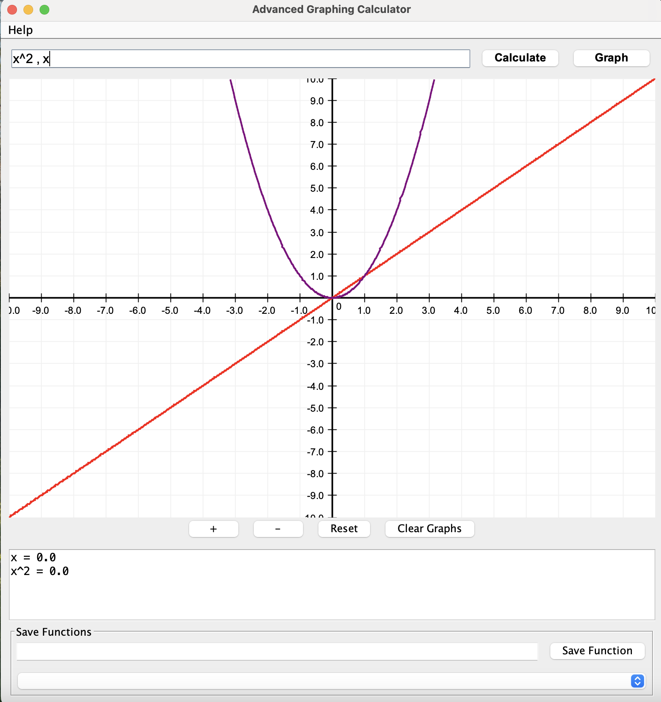
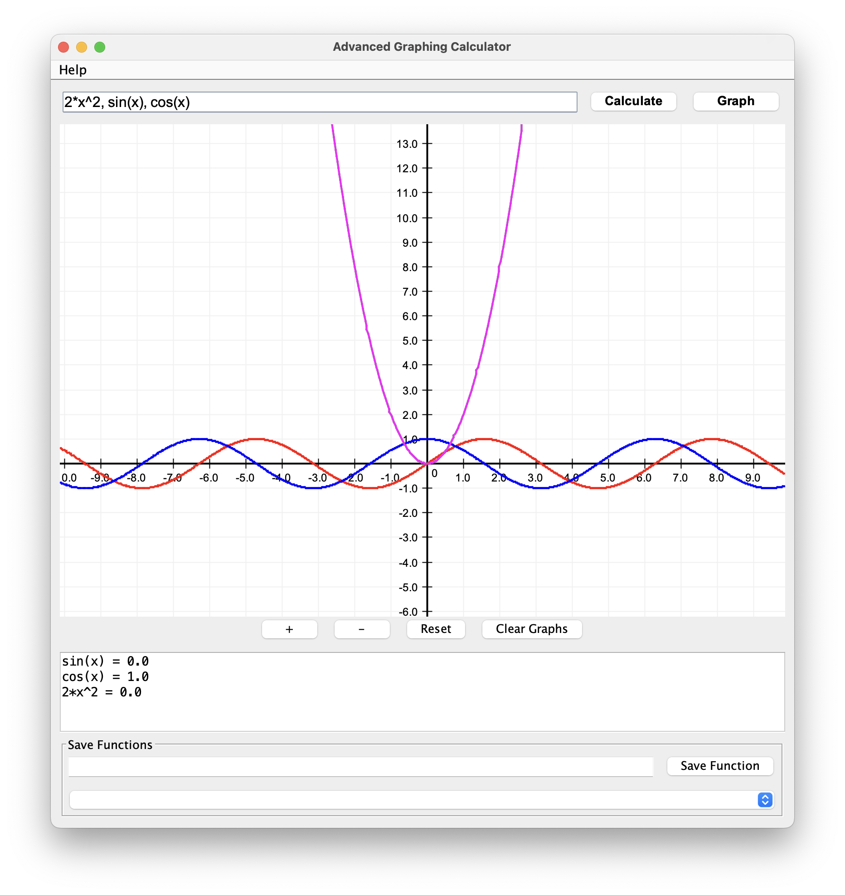

# JAVA Graphing Calculator

A feature-rich calculator application built in Java with graphing capabilities. This application provides an intuitive interface for performing mathematical operations and visualizing functions.


## Screenshots

### Calculator Interface


### Graphing Functions



## Usage Instructions

### Calculating Expressions
1. Enter a mathematical expression in the input field
2. Click "Calculate" to evaluate the expression
3. Results will appear in the output area below

### Graphing Functions
1. Enter a function using 'x' as the variable (e.g., `2*x^2 + 3*x - 5`)
2. Click "Graph" to plot the function
3. Use mouse or buttons to adjust the view:
   - Click and drag to pan
   - Use mouse wheel to zoom
   - Use "+ / -" buttons to zoom in/out
   - Click "Reset" to restore default view


## Supported Mathematical Operations

### Operators
- `+` Addition
- `-` Subtraction
- `*` Multiplication
- `/` Division
- `^` Exponentiation

### Functions
- `sin(x)` Sine function
- `cos(x)` Cosine function
- `tan(x)` Tangent function
- `log(x)` Base-10 logarithm
- `ln(x)` Natural logarithm (base e)
- `sqrt(x)` Square root
- `abs(x)` Absolute value

## System Requirements
- Java Runtime Environment (JRE) 11 or higher

## Getting Started
1. Clone the repository
2. Compile the Java files:
   ```
   javac CalculatorMain.java AdvancedCalculator.java GraphingCalculator.java
   ```
3. Run the application:
   ```
   java CalculatorMain
   ```

## Project Structure
- `CalculatorMain.java` - Main application class and UI components
- `AdvancedCalculator.java` - Mathematical expression parsing and evaluation
- `GraphingCalculator.java` - Function plotting and visualization

## License
[MIT License](LICENSE)